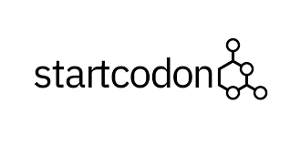
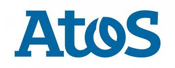



<!-- 

  

    
  

 -->




CV in [PDF](/archive/ifeoma_nwabufo_cv_.pdf) version.

---

# Education
---

<table style="width:100%">
<col width="9%">
<col width="20">
<col >

<tr style="border-bottom:1pt solid #eee">
<td markdown="1">

</td>
<td></td>
<td markdown="1">
[**African Institute for Mathematical Sciences - African Masters of Machine Intelligence (AMMI), Senegal**](https://aimsammi.org/), 01/2022 - 10/2022 
- **MSc in Machine Intelligence**
- *Full scholarship by Facebook and Google, [AMMI](https://aimsammi.org/)*

</td> 
</tr>

<tr style="border-bottom:1pt solid #eee">
<td markdown="1">

</td>
<td></td>
<td markdown="1">
[**African Institute for Mathematical Sciences (AIMS), Senegal**](https://aims-senegal.org/), 10/2020 - 04/2022 
- **Msc in Mathematical Sciences**
<!-- - Supervisor: [Dr. Vukosi Marivate](https://cs.up.ac.za/users/view/vmarivate) -->
- *Full scholarship by AIMS-Senegal, [AIMS](https://aims-senegal.org/)*
</td> 
</tr>

<tr style="border-bottom:1pt solid #eee">
<td markdown="1">

</td>
<td></td>
<td markdown="1">
[**Kaduna State University (KASU), Kaduna, Nigeria**](https://kasu.edu.ng/), 10/2015 - 12/2019 
- **BSc Mathematics**
</td> 
</tr>

</table>

---

# Skills
---

#### Programming

- Python
- SQL

  

#### Libraries

- PyTorch
- TensorFlow

  

#### Tools

- Git 
- LaTeX
- Vagrant

<!-- 
 -->

<!-- #### Language

- English
- French
- Hausa
- Igbo 

--- -->

---
# Work Experiences

<table style="width:100%">
<col width="17%">
<col width="20">
<col >

<table style="width:100%">
<col width="17%">
<col width="20">
<col >

<table style="width:100%">
<col width="17%">
<col width="20">
<col >
<tr style="border-bottom:1pt solid #eee">
<td markdown="1">

</td>
<td></td>
<td markdown="1">
[**Stem Away**](https://stemaway.com/), 2022  
- Bioinformatics Intern :
Bioinformatics Intern working on finding significantly correlated genes with IC50s of drugs and deployment of an R Shiny app.
</td> 
</tr>

<table style="width:100%">
<col width="17%">
<col width="20">
<col >
<tr style="border-bottom:1pt solid #eee">
<td markdown="1">

</td>
<td></td>
<td markdown="1">
[**Start Codon, Cambridge, UK**](https://startcodon.co/), 2022  
- Business Analytics Intern
Business Analytics Intern working on the analysis of startups in Eastern Africa. Produced reports about investment destinations.
</td> 
</tr>

<table style="width:100%">
<col width="17%">
<col width="20">
<col >

<table style="width:100%">
<col width="17%">
<col width="20">
<col >
<tr style="border-bottom:1pt solid #eee">
<td markdown="1">

</td>
<td></td>
<td markdown="1">
[**Atos, Senegal**](https://atos.net/fr/senegal) Oct 2021 - Jan 2022 
- Big Data Intern
Researched on segmentation and social network analysis of customers. Deployed a web clustering app
</td> 
</tr>

</table>

