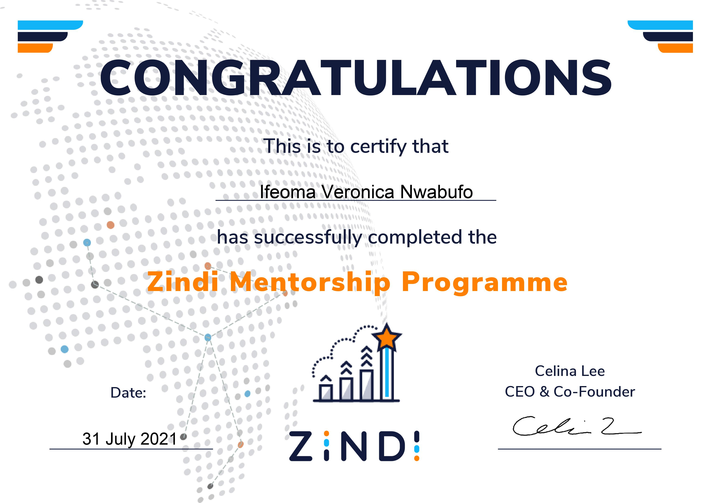
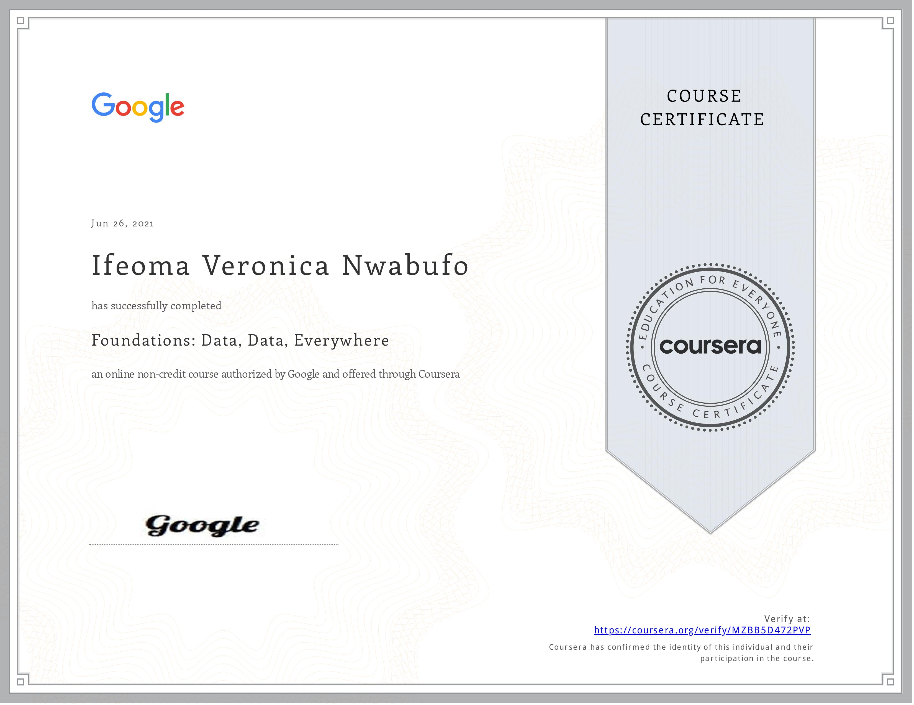
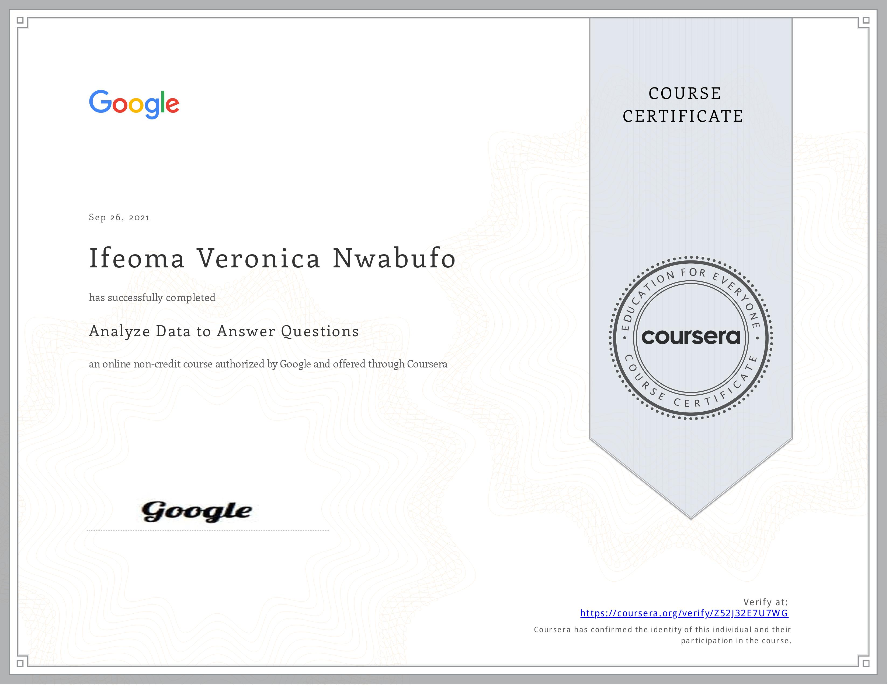
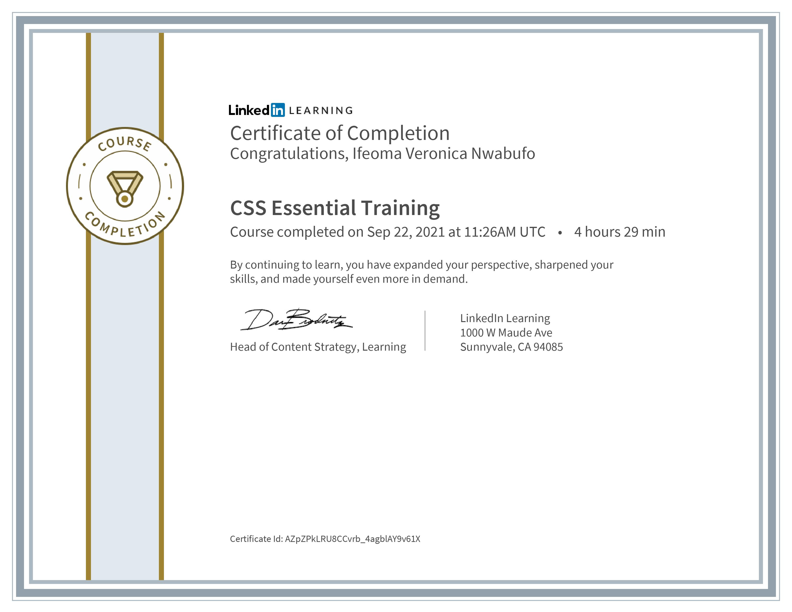



<!-- 

  

    
  

 -->




<h1> Posters</h1>
----
This poster is a summary of the use of t-SimCNE on medical images. If you are wondering what this method is all about, you can read the paper [here](https://arxiv.org/abs/2210.09879) or my [blog post](https://ifysuccessvera.medium.com/unsupervised-visualization-of-images-using-t-simcne-23a9ad15f0).
<table style="width:100%">
<tr></tr>
</table>

----
<h1> Certifications</h1>
----
In no particular order, here are some of the certifications I have from participating in different programs.

<table style="width:100%" >
<tr border-spacing="15px">
<th>

</th>
<th></th>
<th></th>
</tr>
<tr border-spacing="15px">
<th>

</th>
<th></th>
<th></th>
</tr>
</table>
