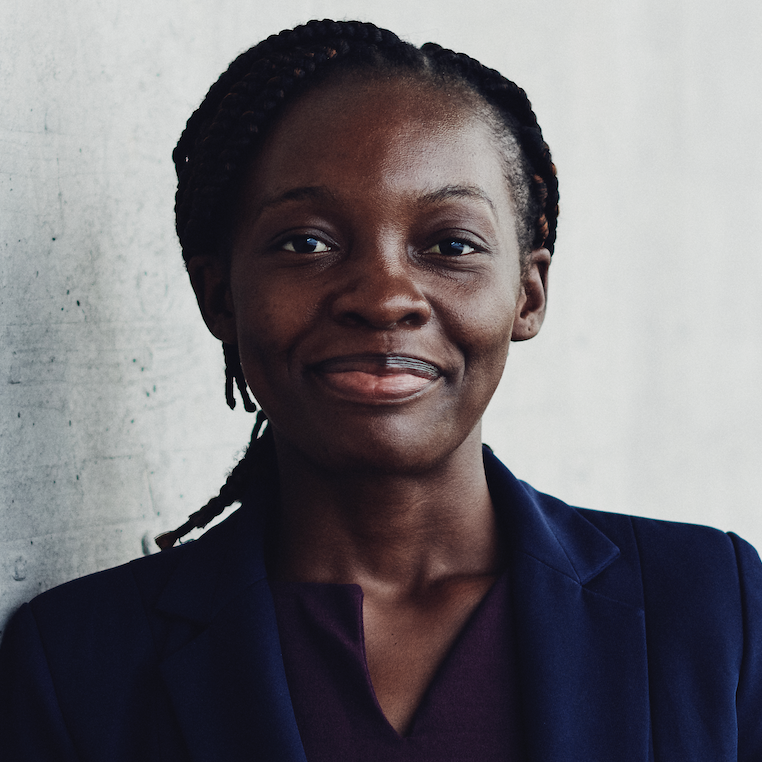



  

    
  

  <h1>
    Homepage
     <small>{{ site.tagline }}</small>
  </h1>

### About Me

My name is Ifeoma Veronica Nwabufo. I enjoy writing short stories, talking on events and playing table tennis. Learning is a lifestyle for me. My curious nature makes me learn from books, videos and people. You'd often find me interacting with people as I try to relearn, unlearn and learn. 

I am currently a Research Fellow with Berens Lab at the Hertie Institute for AI in Brain Health in Tübingen, Germany funded by the Cluster of Excellence - Machine Learning for New Perspectives in Science, University of Tübingen. My project is on the visualization of medical images. Specifically, I am using the [t-SimCNE](https://arxiv.org/abs/2210.09879) method. I have also written a [blog](https://ifysuccessvera.medium.com/unsupervised-visualization-of-images-using-t-simcne-23a9ad15f0) on this method which you might want to see.

I was a student in the [African Masters of Machine Intelligence](https://aimsammi.org/) (AMMI) programme where I studied for an Msc in Machine Intelligence sponsored by Facebook and Google. I also did an MSc in Mathematical Sciences at the [African Institute for Mathematical Sciences](https://aims-senegal.org/) (AIMS) in 2020 where I got exposed to the use of computational tools for analysis. I researched on computational learning theory for my MSc thesis and was supervised by Prof. Rehana Patel. Specifically, my MSc project was on "A Combinatorial Characterisation of PAC-Learnability" where I explored a type of learning framework called Probably Approximately Correct Learning. My undergraduate studies was at [Kaduna State University](https://kasu.edu.ng) (KASU), where I researched on "The Transmission Dynamics of Lassa Fever with Control" under the supervision of Dr. Patrick Noah Okolo.

---

### Research Interests
My research interests include but not limited to:
- Application of Machine Learning to health, finance and education
- Mathematical Epidemiology
- Mathematical Modelling
- Image Analysis
- Natural Language Processing 
    - Multilingual Question Answering for Low Resource Languages
    - Machine Translation 
- Financial Mathematics

---

### Talks and Presentations
- [Deep Learning Optimizers](/archive/optimizers.pdf),  African Masters of Machine Intelligence, Senegal.
- [Gaussian Mixture Models (GMMs) for text classification](/archive/gauusian.pdf) African Masters of Machine Intelligence, Senegal.

---

### News
- [June 2023] I received a travel and accomodation scholarship to attend the Indaba at Ghana.
- [April 2023] I started my research fellowship at the University of Tübingen, Germany.
- [April 2023] Rounded up the first set of students from Data Science Kaduna.
- [January 2023] I started a Data Science group (Data Science Kaduna) with over 400 participants who signed up to learn Data Science.
- [August 2022] I am volunteering to teach Python in a skill acquisition programme organised by students from Virgina Tech, USA
- [August 2022] Got accepted into the Google Developers Machine Learning Bootcamp 
- [June 2022] We won the third prize for our novel idea on Multilingual Question Answering for Low Resource Languages
- [Sept 2021] I organised a webinar to encourage school girls to take up careers in STEM [News Bulletin](https://dotakeaction.org/impact/ifeoma-veronica-nwabufo-encourages-young-girls-in-her-community-to-pursue-career-paths-in-stem/)

---

### Contacts
- Email: ifysuccessvera@gmail.com

### Read my blogs
- Medium: [Ifeoma Veronica Nwabufo](http://ifysuccessvera.medium.com/)