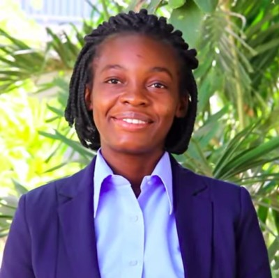



  

    
  

  <h1>
    Homepage
     <small>{{ site.tagline }}</small>
  </h1>

### About Me

My name is Ifeoma Veronica Nwabufo. I am currently a student at the [African Masters of Machine Intelligence](https://aimsammi.org/) (AMMI) programme, working towards an Msc in Machine Intelligence sponsored by Facebook and Google. I also did an MSc in Mathematical Sciences at the [African Institute for Mathematical Sciences](https://aims-senegal.org/) (AIMS) in 2020 where I got exposed to the use of computational tools for analysis. I researched on computational learning theory for my MSc thesis and was supervised by Prof. Rehana Patel. Specifically, my MSc project was on "A Combinatorial Characterisation of PAC-Learnability" where I explored a type of learning framework called Probably Approximately Correct Learning. My undergraduate studies was at [Kaduna State University](https://kasu.edu.ng) (KASU), where I researched on "The Transmission Dynamics of Lassa Fever with Control" under the supervision of Dr. Patrick Noah Okolo.

---

### Research Interests
My research interests include but not limited to:
- Application of Machine Learning to health and finance
- Mathematical Epidemiology
- Mathematical Modelling
- Image Analysis
- Natural Language Processing 
    - Multilingual Question Answering for Low Resource Languages
    - Machine Translation 
- Financial Mathematics

---

### Talks and Presentations
- [Deep Learning Optimizers](/archive/optimizers.pdf),  African Masters of Machine Intelligence, Senegal.
- [Gaussian Mixture Models (GMMs) for text classification](/archive/gauusian.pdf) African Masters of Machine Intelligence, Senegal.

---

### News
- [August 2022] I am volunteering to teach Python in a skill acquisition programme organised by students from Virgina Tech USA
- [August 2022] Got accepted into the Google Developers Machine Learning Bootcamp 
- [June 2022] We won the third prize for our novel idea on Multilingual Question Answering for Low Resource Languages

---

### Contacts
- Email: ifysuccessvera@gmail.com