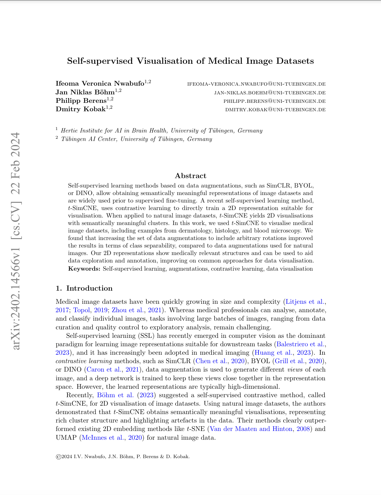
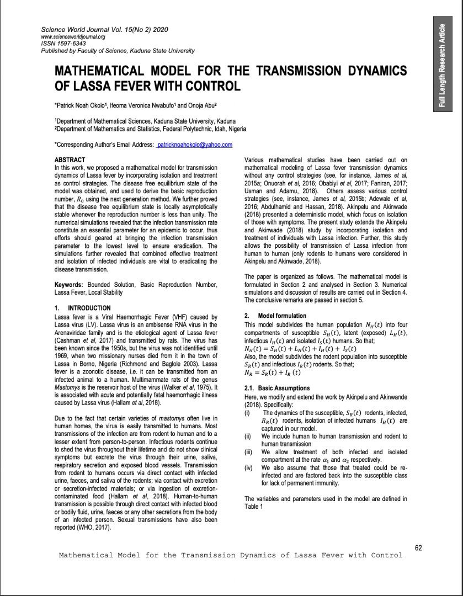






<link rel="stylesheet" href="/glyphicons/css/glyphicons.css">

<table style="width:100%">
<col width="20%">
<col width="10">
<col >
<tr height="50">
<td style="padding-left: 1px;
    padding-bottom: 3px;
    vertical-align: bottom;">
    <strong style="font-size: 25px;">2024</strong></td>
</tr>
<tr style="border-bottom:1pt solid #eee" >
<td markdown="2">
<!-- {:class="img-shadow"} -->

</td>
<td></td>
<td markdown="2">

<b>
Self-supervised Visualisation of Medical Image Datasets </b>

Self-supervised learning methods based on data augmentations, such as SimCLR, BYOL, or DINO, allow obtaining semantically meaningful representations of image datasets and are widely used prior to supervised fine-tuning. A recent self-supervised learning method, $t$-SimCNE, uses contrastive learning to directly train a 2D representation suitable for visualisation. When applied to natural image datasets, $t$-SimCNE yields 2D visualisations with semantically meaningful clusters. In this work, we used $t$-SimCNE to visualise medical image datasets, including examples from dermatology, histology, and blood microscopy. We found that increasing the set of data augmentations to include arbitrary rotations improved the results in terms of class separability, compared to data augmentations used for natural images. Our 2D representations show medically relevant structures and can be used to aid data exploration and annotation, improving on common approaches for data visualisation.

|| <em class="icon-home"/> || <a href="https://arxiv.org/pdf/2402.14566">paper</a>|| 

</td> 
</tr>
<tr height="50">
<td style="padding-left: 1px;
    padding-bottom: 3px;
    vertical-align: bottom;">
    <strong style="font-size: 25px;">2020</strong></td>
</tr>

<tr style="border-bottom:1pt solid #eee" >
<td markdown="1">
<!-- {:class="img-shadow"} -->

</td>
<td></td>
<td markdown="1">

<b>
Mathematical model for the transmission dynamics of Lassa fever with control</b>

In this work, we proposed a mathematical model for transmission dynamics of Lassa fever by incorporating isolation and treatment as control strategies. The disease free equilibrium state of the model was obtained, and used to derive the basic reproduction number, 𝑅0 using the next generation method. We further proved that the disease free equilibrium state is locally asymptotically stable whenever the reproduction number is less than unity. The numerical simulations revealed that the infection transmission rate constitute an essential parameter for an epidemic to occur, thus efforts should geared at bringing the infection transmission parameter to the lowest level to ensure eradication. The simulations further revealed that combined effective treatment and isolation of infected individuals are vital to eradicating the disease transmission.

|| <em class="icon-home"/> || [paper](https://www.ajol.info/index.php/swj/article/view/202949) || 
</td> 
</tr>

</table>

